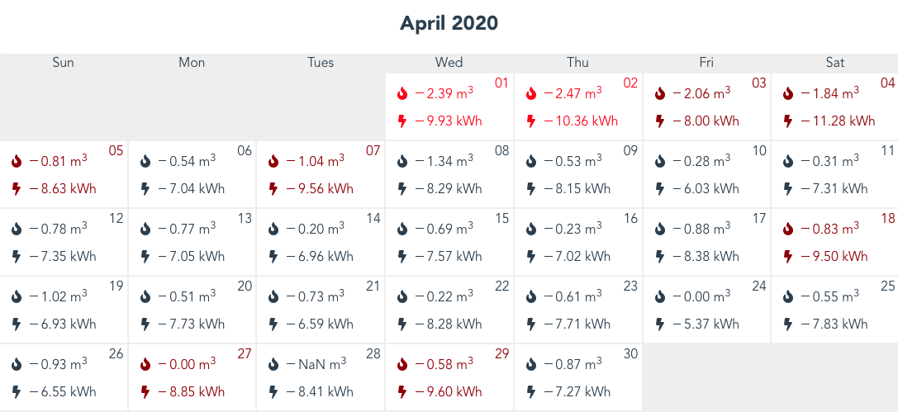

# Octopus Energy Dashboard
[](https://app.netlify.com/sites/octopus-energy/deploys)

The dashboard on Octopus Energy's website gives half-hour usage. In order to learn my own patterns of usage, I was more interested in a bigger picture, capturing an entire month at a time. Thus was born this dashboard.

API Keys and meters data is saved in localStorage and all quries and calculations are sent from the [client interface](https://octopus-energy.netlify.app/).

## Sample Dashboard



## Todo

- [X] Set-up project
- [X] Build ~~robust~~ calendar with fetched data
- [X] Save user data to localStorage (never sent to anyone)
- [X] Add Gas metrics
- [X] Add Elect metrics
- [ ] Give some trends info
- [X] Learn about my energy usage!
- [ ] Favicon
- [ ] Styling / hiding inputs

## Disclaimer

This project is provided as is. **Do not** share your API keys with anyone.

---

## Project setup
```
yarn install
```

### Compiles and hot-reloads for development
```
yarn serve
```

### Compiles and minifies for production
```
yarn build
```

### Lints and fixes files
```
yarn lint
```

### Customize configuration
See [Configuration Reference](https://cli.vuejs.org/config/).
